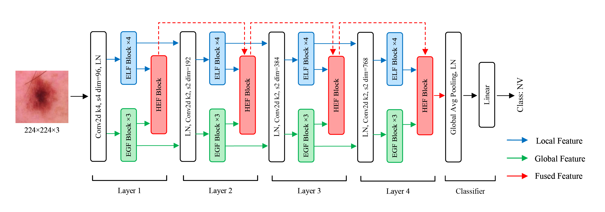
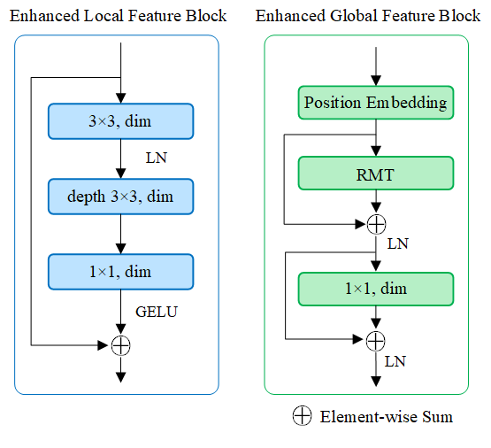
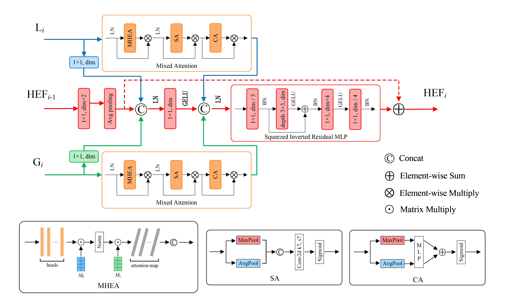
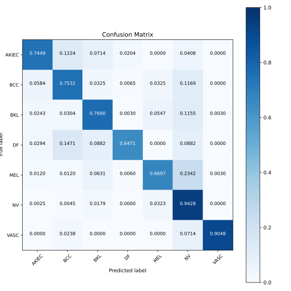
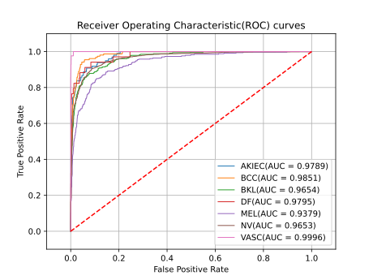
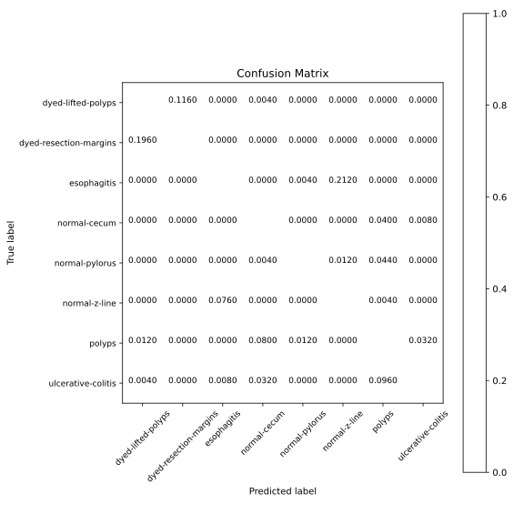
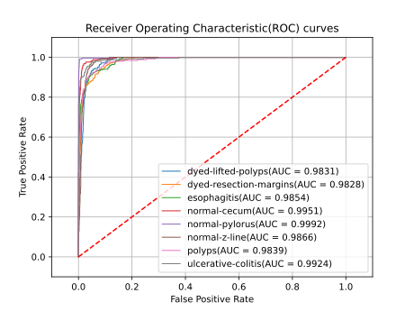
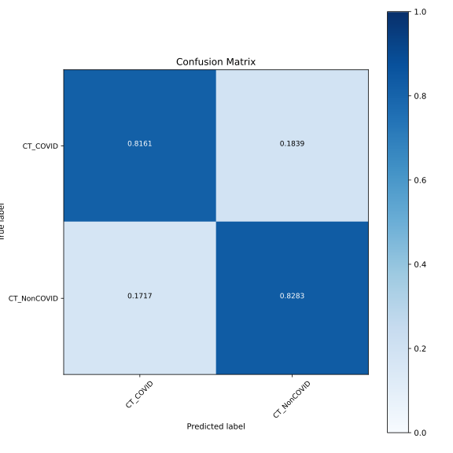
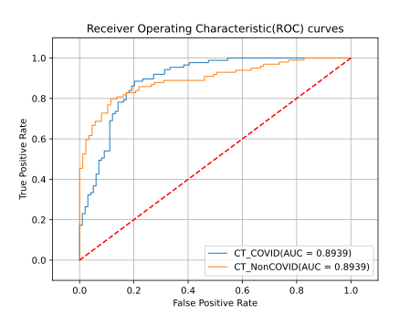

# HEMF
This repository provides the supplementary code and data to the paper entitled "***HEMF: Hierarchical Enhanced Multi-scale Feature Extraction and Fusion Network for Medical Image Classification***".  
  
[](https://doi.org/10.5281/zenodo.15163137)  

Paper link: to be uploaded...  

Authors: Jingdong He, Qiang Shi, Dacheng Shi, Tie Min and Qingjun Xiao.

## Model details
### Overview

### Enhanced Local Feature Block(ELF) & Enhanced Global Feature Block(EGF)

### Hierarchical Enhanced Feature Fusion Block(HEF)

### Code implementation
Main components:  
* [HEMF](./main_model.py)
* [ELF_block](./ELF_block.py)
* [EGF_block](./EGF_block.py)
* [HEF_block](./HEF_block.py)

Others:  
* [MHEA](./MHEA.py)
* [Conv](./Conv.py)
* [DropPath](./DropPath.py)
* [LayerNorm](./LayerNorm.py)

Unofficial implementation of ***CAME***:  

* [baseline_CAME](./baseline_CAME)  

Paper link:  [CAME: Convolution and Attention Construct Multi-Scale Neural Network Efficiently for Medical Image Classification](https://ieeexplore.ieee.org/abstract/document/10394558)

## Experimental environment
### Platfrom
* Ubuntu 20.04.6 LTS
* NVIDIA Tesla T4 16GB
* Python 3.9
* Pytorch 1.13.1
* CUDA 11.7

## Usage
### Data preparation
Download the datasets from the following links:
* [ISIC2018](https://challenge.isic-archive.com/data/#2018)
* [Kvasir](https://datasets.simula.no/kvasir/)
* [COVID19-CT](https://www.kaggle.com/datasets/luisblanche/covidct?resource=download)  

Use [preprocess_dataset.ipynb](./preprocess_dataset.ipynb) to set up training folders, testing folders and validation folders respectively and split them.  
Take ISIC2018 dataset as an example:  

```bash
├── training_set
│   ├── AKIEC
│   │   ├── xxxx.jpg
│   │   ├── ......
│   │   └── ......
│   ├── BCC
│   ├── BKL
│   ├── DF
│   ├── MEL
│   ├── NV
│   └── VASC
├── test_set
├── validation_set
```

### Training
Use [train.py](./train.py).
### Testing
Use [test.py](./test.py).

## Performance
See [result.ipynb](./result.ipynb) for more details.
### Results on ISIC2018 dataset


### Results on Kvasir dataset


### Results on COVID19-CT dataset



## Reference
Some of our codes are borrowed from:
* [HiFuse](https://github.com/huoxiangzuo/HiFuse)
* [RMT](https://github.com/qhfan/RMT)
* [FightingCV](https://github.com/xmu-xiaoma666/External-Attention-pytorch)

## Citation
If you find our code useful for your research, please consider citing our paper:  
```bash
To be uploaded...
```

